# Software Requirements Specification (SRS)
## User Registration & Authentication System

**Document Version**: 1.0  
**Date**: February 7, 2026  
**Project**: IT342_G5_Laspinas_Lab1  
**Status**: Complete - Session 1

---

## Executive Summary

This document specifies the complete technical and functional requirements for a **User Registration and Authentication System** consisting of a Spring Boot backend REST API and a ReactJS web frontend. The system provides secure user registration, login, and profile management with JWT-based authentication and role-based access control.

---

## 1. Project Overview

### 1.1 Purpose
To provide a secure, scalable user authentication system with registration, login, and profile management capabilities using modern web technologies.

### 1.2 Scope
- User registration with unique username and email validation
- Secure login with JWT token generation
- Protected user profile access
- Role-based user classification (USER/ADMIN)
- Account activation status management
- Password encryption using BCrypt

### 1.3 Technology Stack

**Backend:**
- Java 17
- Spring Boot 3.0
- Spring Security 6.0
- Spring Data JPA
- JWT (jjwt 0.12.3)
- MySQL 8.0
- BCrypt Password Encoder
- Maven

**Frontend:**
- React 18.2
- React Router v6
- Axios
- Vite
- CSS3

**Database:**
- MySQL 8.0
- Hibernate ORM

---

## 2. Entity Relationship Diagram (ERD)

### 2.1 Database Schema Overview

The system uses a single **Users** table to store user account information with proper constraints for data integrity.


### 2.2 Users Table Specification

| Field Name | Data Type | Constraints | Description |
|------------|-----------|-------------|-------------|
| id | BIGINT | PK, AUTO_INCREMENT | Unique user identifier |
| username | VARCHAR(50) | UNIQUE, NOT NULL | User's login username |
| email | VARCHAR(100) | UNIQUE, NOT NULL | User's email address |
| password | VARCHAR(255) | NOT NULL | BCrypt encrypted password |
| role | VARCHAR(20) | NOT NULL, DEFAULT='USER' | User role (USER or ADMIN) |
| isActive | BOOLEAN | NOT NULL, DEFAULT=true | Account activation status |
| createdAt | TIMESTAMP | NOT NULL, DEFAULT=CURRENT_TIMESTAMP | Account creation timestamp |
| updatedAt | TIMESTAMP | NOT NULL, DEFAULT=CURRENT_TIMESTAMP ON UPDATE | Last update timestamp |

### 2.3 Indexes
- Primary Key: `id`
- Unique Keys: `username`, `email`
- Search Index: `username`, `email` (for faster lookups)

### 2.4 SQL Schema Creation

```sql
CREATE DATABASE auth_db CHARACTER SET utf8mb4 COLLATE utf8mb4_unicode_ci;

USE auth_db;

CREATE TABLE users (
    id BIGINT PRIMARY KEY AUTO_INCREMENT,
    username VARCHAR(50) UNIQUE NOT NULL,
    email VARCHAR(100) UNIQUE NOT NULL,
    password VARCHAR(255) NOT NULL,
    role VARCHAR(20) NOT NULL DEFAULT 'USER',
    isActive BOOLEAN NOT NULL DEFAULT true,
    createdAt TIMESTAMP NOT NULL DEFAULT CURRENT_TIMESTAMP,
    updatedAt TIMESTAMP NOT NULL DEFAULT CURRENT_TIMESTAMP ON UPDATE CURRENT_TIMESTAMP,
    INDEX idx_username (username),
    INDEX idx_email (email)
) ENGINE=InnoDB DEFAULT CHARSET=utf8mb4 COLLATE=utf8mb4_unicode_ci;
```

---

## 3. Use Case Diagram

### 3.1 System Actors

1. **Guest User**: Unauthenticated user accessing the system
2. **Authenticated User**: User with valid JWT token
3. **System**: Backend authentication and authorization system

### 3.2 Use Cases

```mermaid
graph TD
    GuestUser["👤 Guest User"]
    AuthUser["👤 Authenticated User"]
    System["🔐 System"]
    
    GuestUser -->|Register Account| RegisterUC["Register Account<br/>- Validate Username<br/>- Validate Email<br/>- Encrypt Password<br/>- Create User Record"]
    
    GuestUser -->|Login| LoginUC["Login<br/>- Validate Credentials<br/>- Generate JWT Token<br/>- Return User Profile"]
    
    AuthUser -->|View Profile| ProfileUC["View Personal Profile<br/>- Retrieve User Data<br/>- Display User Info<br/>- Show Account Status"]
    
    AuthUser -->|Logout| LogoutUC["Logout<br/>- Clear Token<br/>- Redirect to Login"]
    
    System -.->|Deny Access| DenyUC["Access Denied<br/>- For Unauthorized<br/>- For Inactive Accounts"]
    
    RegisterUC -.->|Sends Token| AuthUser
    LoginUC -.->|Sends Token| AuthUser
    DenyUC -.->|Redirect to Login| GuestUser
```



### 3.3 Use Case Descriptions

#### UC-1: Register Account
- **Actor**: Guest User
- **Precondition**: User is not logged in
- **Main Flow**:
  1. User navigates to register page
  2. User enters username, email, password, confirm password
  3. System validates all inputs
  4. System checks username and email uniqueness
  5. System encrypts password using BCrypt
  6. System creates user record with ROLE="USER" and isActive=true
  7. System returns success message
  8. User is redirected to login page
- **Postcondition**: User account created and ready for login

#### UC-2: Login
- **Actor**: Guest User
- **Precondition**: User has registered account
- **Main Flow**:
  1. User navigates to login page
  2. User enters username/email and password
  3. System validates inputs
  4. System queries User table by username or email
  5. If user not found → Go to error
  6. System verifies password using BCrypt
  7. If password invalid → Go to error
  8. System checks isActive status
  9. If inactive → Go to error
  10. System generates JWT token valid for 24 hours
  11. System returns token and user profile
  12. Frontend stores token in localStorage
  13. User is redirected to dashboard
- **Error Flow**: Show appropriate error message and retry
- **Postcondition**: User authenticated with valid JWT token

#### UC-3: View Profile
- **Actor**: Authenticated User
- **Precondition**: User has valid JWT token
- **Main Flow**:
  1. User navigates to dashboard
  2. Frontend checks if token exists in localStorage
  3. If no token → Redirect to login
  4. Frontend includes token in Authorization header
  5. System validates JWT token
  6. System queries user by username from token claims
  7. System returns user profile (username, email, role, isActive)
  8. Frontend displays profile information
- **Postcondition**: User profile displayed

#### UC-4: Logout
- **Actor**: Authenticated User
- **Precondition**: User is logged in
- **Main Flow**:
  1. User clicks logout button
  2. Frontend removes token from localStorage
  3. Frontend clears user data from localStorage
  4. User is redirected to login page
- **Postcondition**: User is logged out, token is cleared

#### UC-5: Access Denied
- **Trigger**: User attempts protected action without token or with invalid token
- **Main Flow**:
  1. System receives request without valid token
  2. System returns 401 Unauthorized error
  3. Frontend redirects user to login page
- **Postcondition**: User redirected to login

---

## 4. Activity Diagram

### 4.1 Combined Registration, Login, and Logout Flow

```mermaid
graph TD
    Start([User Opens App]) --> Choice{User Action?}
    
    Choice -->|Register| RegStart([Enter Registration Info])
    Choice -->|Login| LoginStart([Enter Login Credentials])
    Choice -->|Already Logged In| DashCheck{Valid Token?}
    
    %% Registration Flow
    RegStart --> RegValidate{Validate Input<br/>- Username<br/>- Email<br/>- Password Match<br/>- Min Length}
    RegValidate -->|Invalid| RegError["❌ Show Error<br/>Invalid Input"]
    RegError --> RegStart
    RegValidate -->|Valid| RegCheckUser{Username or<br/>Email Exists?}
    RegCheckUser -->|Yes| RegError2["❌ Show Error<br/>Already Exists"]
    RegError2 --> RegStart
    RegCheckUser -->|No| RegEncrypt["🔐 Encrypt Password<br/>BCrypt"]
    RegEncrypt --> RegSave["💾 Save User to DB<br/>- Set role=USER<br/>- Set isActive=true"]
    RegSave --> RegSuccess["✅ Registration Success"]
    RegSuccess --> RedirectLogin["Redirect to Login"]
    
    %% Login Flow
    LoginStart --> LoginValidate{Validate Login<br/>Input}
    LoginValidate -->|Invalid| LoginError["❌ Show Error<br/>Invalid Input"]
    LoginError --> LoginStart
    LoginValidate -->|Valid| LoginFind["🔍 Find User<br/>by Username/Email"]
    LoginFind --> LoginFound{User<br/>Found?}
    LoginFound -->|No| LoginError2["❌ Invalid Credentials"]
    LoginError2 --> LoginStart
    LoginFound -->|Yes| LoginCheckActive{Account<br/>Active?}
    LoginCheckActive -->|No| LoginInactive["❌ Account Inactive"]
    LoginInactive --> LoginStart
    LoginCheckActive -->|Yes| LoginVerify["🔐 Verify Password<br/>BCrypt Compare"]
    LoginVerify --> PwdMatch{Password<br/>Match?}
    PwdMatch -->|No| LoginError2
    PwdMatch -->|Yes| LoginToken["🎫 Generate JWT Token<br/>- Subject: username<br/>- Claim: userId<br/>- Exp: 24 hours"]
    LoginToken --> LoginSuccess["✅ Login Success<br/>Return Token + Profile"]
    LoginSuccess --> StoreToken["💾 Store Token<br/>in localStorage"]
    StoreToken --> GotoDash["Redirect to Dashboard"]
    
    %% Dashboard/Profile Flow
    GotoDash --> DashCheck
    DashCheck -->|No Token| RedirectLogin
    RedirectLogin --> LoginStart
    DashCheck -->|Token Exists| ValidateToken{Validate<br/>JWT Token}
    ValidateToken -->|Invalid| TokenError["❌ Token Expired<br/>Redirect to Login"]
    TokenError --> RedirectLogin
    ValidateToken -->|Valid| FetchProfile["🔍 Fetch User Profile<br/>Query: findByUsername"]
    FetchProfile --> DisplayProfile["📋 Display Profile<br/>- Username<br/>- Email<br/>- Role<br/>- Account Status<br/>- User ID"]
    
    %% Logout Flow
    DisplayProfile --> LogoutChoice{User Action?}
    LogoutChoice -->|Click Logout| Logout["🚪 Logout"]
    Logout --> ClearToken["🗑️ Clear Token<br/>from localStorage"]
    ClearToken --> ClearUser["🗑️ Clear User Data<br/>from localStorage"]
    ClearUser --> RedirectLoginFinal["Redirect to Login Page"]
    RedirectLoginFinal --> End([Session Ended])
    
    LogoutChoice -->|View Profile| DisplayProfile
```



---

## 5. Class Diagram

### 5.1 Backend Architecture


### 5.2 Frontend Component Hierarchy


---

## 6. Sequence Diagrams

### 6.1 Registration Sequence

```mermaid
sequenceDiagram
    participant User as 👤 User<br/>Browser
    participant React as ⚛️ Frontend<br/>RegisterPage
    participant Axios as 📡 API<br/>Client
    participant Backend as 🔧 Backend<br/>Spring Boot
    participant AuthSvc as 🔐 AuthService
    participant JPA as 💾 Database<br/>JPA
    participant Crypto as 🔒 BCrypt<br/>Encoder
    
    User->>React: Fills registration form<br/>username, email, password
    React->>React: Client-side validation
    React->>Axios: POST /auth/register<br/>RegisterRequest payload
    
    Axios->>Backend: HTTP POST request<br/>AuthController.register()
    Backend->>AuthSvc: Call register(RegisterRequest)
    
    AuthSvc->>AuthSvc: Validate inputs<br/>- Not empty<br/>- Password match<br/>- Min length
    
    AuthSvc->>JPA: existsByUsername(username)
    JPA-->>AuthSvc: false or true
    
    alt Username Exists
        AuthSvc-->>Backend: ApiResponse(false, "Username exists")
    else Username Unique
        AuthSvc->>JPA: existsByEmail(email)
        JPA-->>AuthSvc: false or true
        
        alt Email Exists
            AuthSvc-->>Backend: ApiResponse(false, "Email exists")
        else Email Unique
            AuthSvc->>Crypto: encode(password)
            Crypto-->>AuthSvc: €password_hashed
            
            AuthSvc->>JPA: save(User)<br/>role=USER, isActive=true
            JPA-->>AuthSvc: User(id, username, email)
            
            AuthSvc-->>Backend: ApiResponse(true,<br/>"Registration successful",<br/>UserProfileResponse)
        end
    end
    
    Backend-->>Axios: HTTP 200/400<br/>JSON response
    Axios-->>React: Response data
    React->>React: Parse response
    
    alt Success
        React->>React: Show success message
        React->>React: Store temporary data
        React->>User: Redirect to login
    else Error
        React->>User: Display error message
    end
```



### 6.2 Login Sequence


### 6.3 Dashboard Access (Protected Route) Sequence


### 6.4 Logout Sequence

```mermaid
sequenceDiagram
    participant User as 👤 User<br/>Dashboard
    participant React as ⚛️ Frontend
    participant Storage as 💾 localStorage
    participant Router as 🗺️ React Router
    participant Backend as 🔧 Backend<br/>(Session Invalidation)
    
    User->>React: Click Logout button
    React->>React: handleLogout() triggered
    
    React->>Storage: removeItem('token')
    note right of Storage: JWT token removed<br/>No longer in auth header
    
    React->>Storage: removeItem('user')
    note right of Storage: User profile data removed
    
    React->>Router: navigate('/login')
    Router-->>React: Route change
    React-->>User: Redirect to login page
    
    note right of React: Session ended<br/>User must re-authenticate<br/>to access protected routes
```



---

## 7. API Specifications

### 7.1 Base URL
```
http://localhost:8080/api
```

### 7.2 Authentication Endpoints

#### 7.2.1 Register User
```http
POST /auth/register
Content-Type: application/json
```

**Request Body:**
```json
{
  "username": "johndoe",
  "email": "john@example.com",
  "password": "SecurePass123",
  "confirmPassword": "SecurePass123"
}
```

**Success Response (200):**
```json
{
  "success": true,
  "message": "User registered successfully",
  "data": {
    "id": 1,
    "username": "johndoe",
    "email": "john@example.com",
    "role": "USER",
    "isActive": true
  }
}
```

**Error Responses:**
```json
{
  "success": false,
  "message": "Username already exists"
}
```

#### 7.2.2 Login User
```http
POST /auth/login
Content-Type: application/json
```

**Request Body:**
```json
{
  "username": "johndoe",
  "password": "SecurePass123"
}
```

**Success Response (200):**
```json
{
  "success": true,
  "message": "Login successful",
  "data": {
    "token": "eyJhbGciOiJIUzI1NiIsInR5cCI6IkpXVCJ9...",
    "type": "Bearer",
    "id": 1,
    "username": "johndoe",
    "email": "john@example.com",
    "role": "USER",
    "isActive": true
  }
}
```

**Error Responses:**
```json
{
  "success": false,
  "message": "Invalid username/email or password"
}
```

### 7.3 User Endpoints

#### 7.3.1 Get Current User Profile (Protected)
```http
GET /user/me
Authorization: Bearer {jwt_token}
```

**Success Response (200):**
```json
{
  "success": true,
  "message": "User retrieved successfully",
  "data": {
    "id": 1,
    "username": "johndoe",
    "email": "john@example.com",
    "role": "USER",
    "isActive": true
  }
}
```

**Error Response (401):**
```json
{
  "success": false,
  "message": "Unauthorized"
}
```

### 7.4 HTTP Status Codes
- **200 OK**: Successful request
- **400 Bad Request**: Invalid input or validation failure
- **401 Unauthorized**: Missing or invalid token
- **404 Not Found**: Resource not found
- **500 Internal Server Error**: Server error

---

## 8. Security Specifications

### 8.1 Password Security
- **Encryption**: BCrypt with 10 salt rounds
- **Never Store Plain Text**: All passwords hashed before database storage
- **Matching**: BCrypt.matches() for verification

### 8.2 JWT Token Security
- **Algorithm**: HMAC SHA-256 (HS256)
- **Secret Key**: Minimum 256-bit key (in production: environment variable)
- **Payload Structure**:
  - `sub` (subject): username
  - `userId`: User ID claim
  - `iat` (issued at): Token generation time
  - `exp` (expiration): 24 hours from issue time
-oken Type**: Bearer
- **Transmission**: Authorization header with "Bearer " prefix

### 8.3 CORS Configuration
- **Allowed Origins**:
  - http://localhost:3000
  - http://localhost:5173
- **Allowed Methods**: GET, POST, PUT, DELETE, OPTIONS
- **Allowed Headers**: Content-Type, Authorization
- **Credentials**: Allowed

### 8.4 Input Validation
- **Username**: Min 3 chars, alphanumeric with optional underscore
- **Email**: RFC-compliant email format validation
- **Password**: Minimum 6 characters, ensure match with confirm password
- **Server-side**: All inputs validated on backend before processing

### 8.5 Data Protection
- **At Rest**: Database encryption (MySQL SSL if production)
- **In Transit**: HTTPS in production
- **User Data**: Only sent after authentication
- **Token Storage**: localStorage (frontend), clear on logout

---

## 9. Error Handling

### 9.1 Validation Errors
| Error | HTTP Status | Message |
|-------|-------------|---------|
| Empty username | 400 | "Username is required" |
| Empty email | 400 | "Email is required" |
| Username exists | 400 | "Username already exists" |
| Email exists | 400 | "Email already exists" |
| Password mismatch | 400 | "Passwords do not match" |
| Short password | 400 | "Password must be at least 6 characters" |

### 9.2 Authentication Errors
| Error | HTTP Status | Message |
|-------|-------------|---------|
| User not found | 401 | "Invalid username/email or password" |
| Password incorrect | 401 | "Invalid username/email or password" |
| Account inactive | 401 | "Account is inactive" |
| Invalid token | 401 | "Unauthorized" |
| Expired token | 401 | "Unauthorized" |

### 9.3 Server Errors
| Status | Description |
|--------|-------------|
| 404 | Resource not found |
| 500 | Internal server error |

---

## 10. Performance Requirements

- **API Response Time**: < 500ms for typical requests
- **Page Load Time**: < 2 seconds
- **Database Query**: Indexed on username, email for O(1) lookups
- **Token Validation**: < 10ms per request

---

## 11. Non-Functional Requirements

### 11.1 Scalability
- JWT tokens are stateless (no server-side session storage needed)
- Database indexes optimize user lookup performance
- Horizontal scaling possible without session shared state

### 11.2 Maintainability
- Clean separation of concerns (Controller, Service, Repository)
- DTOs separate API contracts from domain models
- Consistent error handling and logging

### 11.3 Reliability
- Password never logged or exposed
- Transactions for critical operations
- Timestamps track all changes (createdAt, updatedAt)

### 11.4 Usability
- Clear error messages for users
- Responsive frontend design
- Intuitive navigation flow

---

## 12. Testing Requirements

### 12.1 Unit Tests
- [ ] RegisterRequest validation
- [ ] Password encryption correctness
- [ ] JWT token generation and validation
- [ ] User repository queries

### 12.2 Integration Tests
- [ ] Registration endpoint with database
- [ ] Login endpoint with BCrypt verification
- [ ] Protected endpoint access with token
- [ ] Token expiration behavior

### 12.3 End-to-End Tests
- [ ] Complete registration flow
- [ ] Complete login flow
- [ ] Dashboard access with valid token
- [ ] Logout clears token
- [ ] Protected route redirect without token

---

## 13. Deployment & Configuration

### 13.1 Environment Variables (Production)
```properties
DB_HOST=production-db-host
DB_USERNAME=db_user
DB_PASSWORD=secure_password
JWT_SECRET=complex-256-bit-secret-key
JWT_EXPIRATION=86400000
SERVER_PORT=8080
CORS_ORIGINS=production-frontend-url
```

### 13.2 Database Initialization
- Run SQL schema creation script
- Set up database user with appropriate permissions
- Enable SSL for secure connections

### 13.3 Server Deployment
- Package as JAR : `mvn clean build`
- Deploy on Java 17+ runtime
- Configure application.properties for production
- Set up health check endpoint

---

## 14. Compliance & Standards

- **REST API**: RESTful API design principles
- **Security**: OWASP Top 10 considerations
- **Data Protection**: Hashed passwords, encrypted tokens
- **Code Quality**: Spring Boot best practices

---

## 15. Future Enhancements

### Phase 2 Features
- [ ] Email verification on registration
- [ ] Password reset functionality
- [ ] Two-factor authentication
- [ ] Role-based access control (RBAC) enforcement
- [ ] Refresh token mechanism
- [ ] Account deletion
- [ ] User profile updates

### Phase 3 Features
- [ ] Mobile app implementation (Flutter/React Native)
- [ ] OAuth2/Social login integration
- [ ] Audit logging
- [ ] Session management across devices
- [ ] Rate limiting

---

## 16. Document Approval & Version History

| Version | Date | Author | Changes |
|---------|------|--------|---------|
| 1.0 | Feb 7, 2026 | IT342_G5 | Initial SRS - Complete backend and frontend specifications |

---

## Appendix A: Database Initialization Script

```sql
-- Create database
CREATE DATABASE auth_db CHARACTER SET utf8mb4 COLLATE utf8mb4_unicode_ci;

-- Use database
USE auth_db;

-- Create users table
CREATE TABLE users (
    id BIGINT PRIMARY KEY AUTO_INCREMENT,
    username VARCHAR(50) UNIQUE NOT NULL,
    email VARCHAR(100) UNIQUE NOT NULL,
    password VARCHAR(255) NOT NULL,
    role VARCHAR(20) NOT NULL DEFAULT 'USER',
    isActive BOOLEAN NOT NULL DEFAULT true,
    createdAt TIMESTAMP NOT NULL DEFAULT CURRENT_TIMESTAMP,
    updatedAt TIMESTAMP NOT NULL DEFAULT CURRENT_TIMESTAMP ON UPDATE CURRENT_TIMESTAMP,
    INDEX idx_username (username),
    INDEX idx_email (email)
) ENGINE=InnoDB DEFAULT CHARSET=utf8mb4 COLLATE=utf8mb4_unicode_ci;

-- Sample data for testing
INSERT INTO users (username, email, password, role, isActive) VALUES
('admin_user', 'admin@example.com', '$2a$10$slYQmyNdGzin7olVN3p5be4DlH.PKZbv5H8KnzzVgXXbVxzy1.KZm', 'ADMIN', true),
('test_user', 'test@example.com', '$2a$10$N9qo8uLOickgx2ZMRZoMye8d5/QXozBCqWL8ZgFmJHQ9Z4oJ0Q', 'USER', true);
```

---

**Document Classified As**: Project Documentation  
**Last Updated**: February 7, 2026  
**Status**: ✅ Complete - Ready for Implementation
